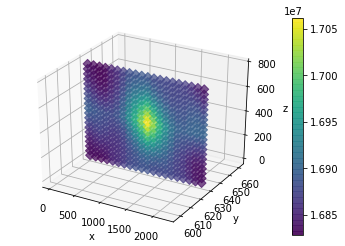

# gammapy-

## Installation

Spatial continuity functions are the representation of spatial dependencies among statistical variables and the space. They could be considered as the backbone of geostatistical analysis. Gammapy is a simple library to help spatial continuity calculations based on GamV from GSLib 90 package. 

To install the package, clone the folder from repository and run the command in the gammapy\dist folder. 

```text
pip install gammapy-0.0.0tar.gz
```

## Example

```text
import numpy as np 
import pandas as pd 
from gammapy import gammapy 


data = np.loadtxt('Ferro 3d.dat', skiprows= 1, unpack=False)
df = pd.DataFrame(data, columns=['X','Y','Z','fe'])

nlags = 10
lagdistance= 80
lineartolerance = 40
htolerance = 45.0
vtolerance = 45.0
hband = 40
vband = 40 
vband = 40
azimuth = 157
dip = 30

gamma = gammapy.funcs_3D(df,'X','Y','Z','fe','fe',nlags,lagdistance,
                         lineartolerance, htolerance, vtolerance, 
                         hband, vband, azimuth,dip)

variogram = gamma.calculate_experimental_function("Variogram")


gamma.modelling(experimental_dataframe = variogram, 
                rotation_reference = [157,30,0],
                model_func = ["Spherical", "Spherical"],
                ranges =[[100,50,50],[250,50,50]],
                contribution = [10,30],
                nugget = 5,
                inverted = False)

print(help(gamma.covariogram_map_3d))
gamma.covariogram_map_3d(df, 'X', 'Y', 'Z', 'fe',plot=True, cuty=[600,650])
```




## Dependencies 

Gammapy needs several libraries to run properly. To better run gammapy functions, verify if you have installed these following dependencies.

* numpy 1.15.4
* pandas 0.23.4
* matplotlib 3.0.2
* itertools 
* scipy 1.1.0
* sklearn 0.20.1
* mpl\_toolkits 

## Experimental Continuity functions 

The 3D experimental functions are related to funcs\_3D object. To create experimental spatial continuity functions you should inform the following attributes:

* **dataset** = pandas Dataframe containing \(X,Y,Z coordinates and Head and tail properties\)
* **x\_label** = A string containing the name of X coordinates
* **y\_label** = A string containing the name of Y coordinates
* **z\_label** = A string containing the name of Z coordinates
* **head\_property** = string containing the name of the first propertie
* **tail property** = string containing the name of the second propertie
* **nlags** = integer containing the number of lags in experimental continuity functions
* **lagdistance** = float containing the lag size
* **lineartolerance** = float containing the linear tolerance
* **htolerance** = float containing the horizontal tolerance value in degrees
* **vtolerance** = float containing the vertical tolerance value in degrees
* **hband** = float containing the horizontal band width
* **vband** = float containing the vertical band width
* **azimuth** = float containing the experimental function azimuth in degrees
* **dip** = float containing the experimental function dip in degrees

#### If you have any problem with the class parameters, please use the help\(\) command 

The following methods are used to calculate spatial continuity functions:


```text
   """"funcs_3D
   Instances: 
   dataset (pandas.Dataframe): Input Dataframe containing the dataset 
   x_label (string): Label of x coordinates contained in dataset 
   y_label (string): Label of y coordinates contained in dataset 
   z_label (string): Label of z coordinates contained in dataset 
   head_property  (string): label of head property contained in dataset 
   tail property (string): label of tail property contained in dataset  
   lagdistance (double): lag size of experimental spatial functions
   lineartolerance (double): lag linear tolerance of experimental spatial functions 
   htolerance (double): angular horizontal tolerance of experimental spatial functions in degrees   
   vtolerance  (double): angular vertical tolerance of experimental spatial functions in degrees 
   hband (double): horizontal bandwidth of spatial functions  
   vband  (double): vertical bandwidth of spatial functions  
   azimuth  (double): Azimuth value for experimental continuity function in degrees 
   dip (double): Dip value for experimental continuity functions in degrees 

   Methods:
   distances(self) : Calculate the matrix distance of all pairs 
   permissible_pairs_omni (self, lag_multiply) : Calculate the permissible sample pairs for omnidirecional functions for irregular grids 
   permissible_pairs(self , lag_multiply) : Calculate the permissible sample pairs for directional functions for irregular grids
   hscatter(self, lag_multiply) : Calculate the hscatterplot for a distance multiple of a lag
   calculate_experimental(self , lag_multiply,  type_var) : Calculate the experimental continuity function value for a distance multiple of a lag and a type of variogram 
   calculate_experimental_omini(self , lag_multiply,  type_var) : Calculate the experimental omnidirecional continuity function value for a distance multiple of a lag and a type of variogram
   calculate_experimental_function(self, type_var) : Calculate the experimental continuity function for all lag values 
   calculate_experimental_function_omni(self, type_var) : Calculate the omnidirecional experimental continuity function for all lag values

   """
```

## funcs\_3D.distances\(\)

Returns the 3Dimensional distances between all samples 

```text
'''distances
Returns:	
 distance_dataframe (pandas.DataFrame): Pandas Dataframe containing all the distance metrics
 DX (pandas.DataFrame.Series) : Difference of x cartesian coordinates 
 DY (pandas.DataFrame.Series) : = diference of y cartesian values from the head and tails of the vector  
 DZ (pandas.DataFrame.Series) : = diference of z cartesian values from the head and tails of the vector 
 XY (pandas.DataFrame.Series) : = Distance projection on XY plane of the vector  
 H  (pandas.DataFrame.Series) : = Distance value from head and tail of vector  
 Var 1 (head) (pandas.DataFrame.Series) : Value from variable 1 on the head of vector 
 Var 2 (head) (pandas.DataFrame.Series) : Value from variable 2 on the head of vector  
 Var 1 (tail) (pandas.DataFrame.Series) : Value from variable 1 on the tail of vector 
 Var 2 (tail) (pandas.DataFrame.Series) : Value form variable 2 on the tail of vector 
 INDEX HEAD   (pandas.DataFrame.Series) : Index of propertie 1 sample 
 INDEX TAIL   (pandas.DataFrame.Series) : Index of propertie 2 sample
'''
```

## funcs\_3D.permissible\_pairs\_omni \(lag\_multiply\) and funcs\_3D.permissible\_pairs \(lag\_multiply\)

```text
'''permissible_pairs_omni
Args:
 lag_multiply (double): Mutliple of lag distance
Returns:	
 distances (pandas.DataFrame): Returns the permissible sample pairs for omnidirecional functions
'''
```


## funcs\_3D.calculate\_experimental\_function\(self, type\_var\) and funcs\_3D.calculate\_experimental\_function\_omni\(self, type\_var\)


```text
'''calculate_experimental_function
Args:    
 type_var (string): String containing the type of spatial continuity function to calculate
                     5 admissible functions are possible:

                    "Variogram"
                     "Covariogram"
                     "Correlogram"
                     "PairWise"
                     "RelativeVariogram" 
Returns:
 df (pandas.DataFrame): Pandas Dataframe containing the experimental continuity functions of all lags
'''
```

## funcs\_3D.plot\_experimental\_function\(self, type\_var, show\_pairs = False\) and funcs\_3D.plot\_experimental\_function\_omni\(self, type\_var, show\_pairs = False\)


```text
'''plot_experimental_function
Args:
 show_pairs (bool, optional): If True shows the number of pairs calculated for each experimental continuity function value     
 type_var (string): String containing the type of spatial continuity function to calculate
                     5 admissible functions are possible:

                    "Variogram"
                     "Covariogram"
                     "Correlogram"
                     "PairWise"
                     "RelativeVariogram" 
Returns:
 plot (matplotlib.pyplot): Plot of experimental continuity function 
'''
```

## funcs\_3D.modelling\(self, experimental\_dataframe, rotation\_reference, model\_func, ranges, contribution, nugget, inverted= False, plot\_graph = True \)


```text
'''plot_experimental_function)_omni
Args:
 experimental dataframe (pandas.DataFrame): Pandas DataFrame containing experimental continuity functions     
 rotation reference (list(azimuth, dip, rake)): List containing the reference of principal directions angles in degrees 
 model_func(list(string)) : List containing the models for all structures. size of the list must be the same of the number of structures
                             3 admissible functions are possible:
                             "Spherical"
                            "Gaussian"
                            "Exponential"
 ranges(list(list(maximum range, medium range, minimum range))) : list of lists containing the maximum, medium and minimum range for each number of structures
 contribution (list): list of contributions for each strucutre 
 nugget (double): Nugget effect value 
 inverted (bool): If true plot model according covariogram form, otherwise plot model according the variogram form
 plot_graph (bool): If true plot the experimental variogram and the spatial continuity model

Returns:
 plot (matplotlib.pyplot): Plot of omnidirecional experimental continuity function and the spatial continuity model for one direction 
'''
```

## funcs\_3D.modelling\(self, experimental\_dataframe, rotation\_reference, model\_func, ranges, contribution, nugget, inverted= False, plot\_graph = True \)


```text
 '''covariogram_map_3d
 Args:
  property_value(string): String containing the property to create the covariogram map 
  plot(bool, optional): If False do not plot the covariogram map 
  division(int, optional): discretize number of covariogram map 
  alpha(float, optional): the level of transparency (0- transparent, 1-solid)
  cutx (list, optional): list containing the minimum cutsize and the maximum cutsize for x coordinates
  cuty (list, optional): list containing the minimum cutsize and the maximum cutsize for y coordinates
  cutz (list, optional): list containing the minimum cutsize and the maximum cutsize for z coordinates

 Returns:
  Covariance (np.array): Covariance map 
  plot (matplotlib.pyplot): Plot of Covariance map in three dimensional scale 
 '''
```


